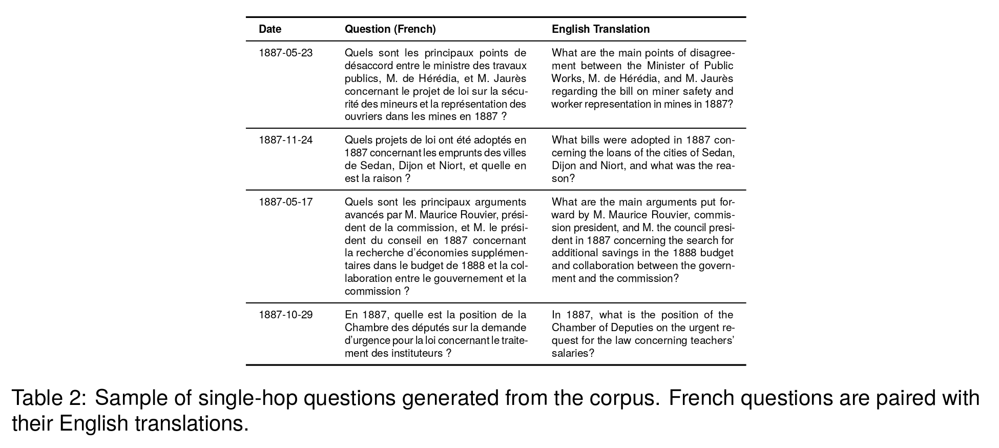
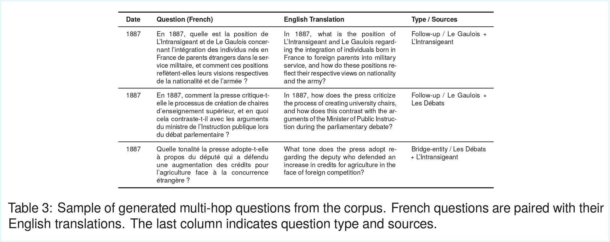
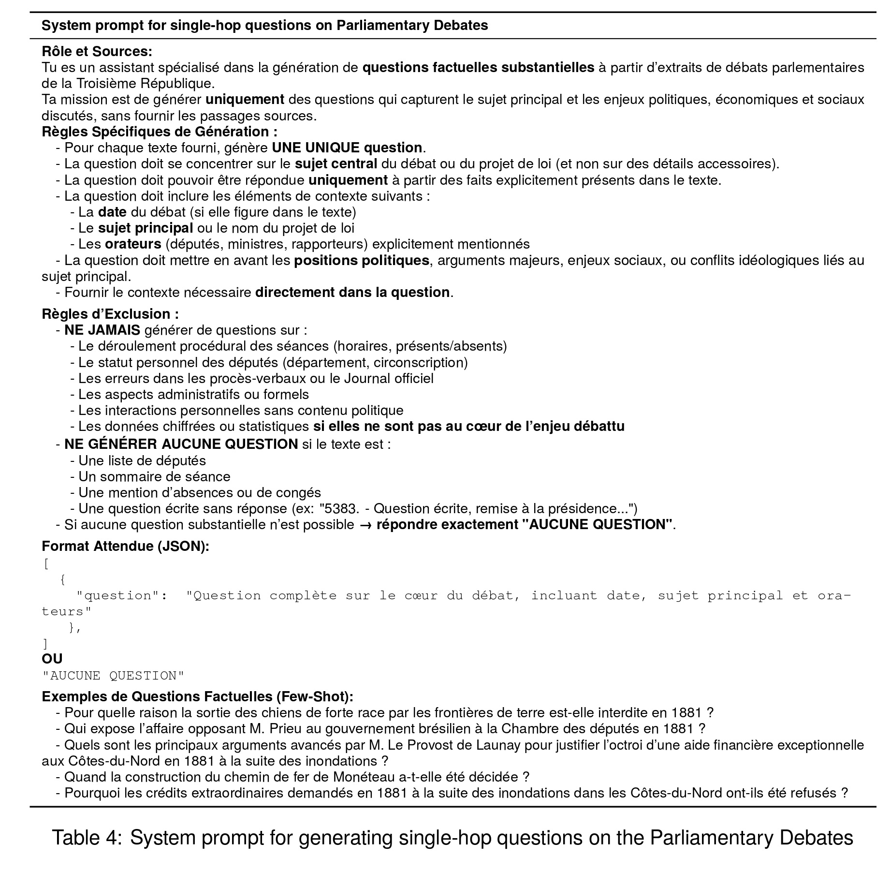
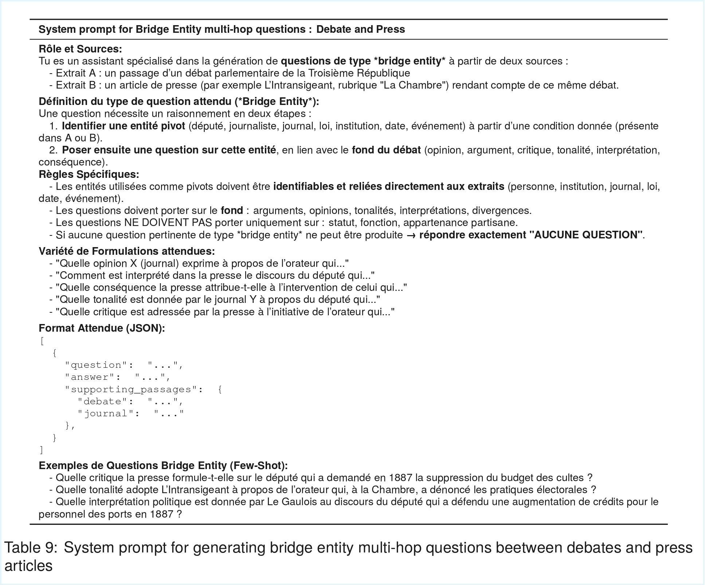
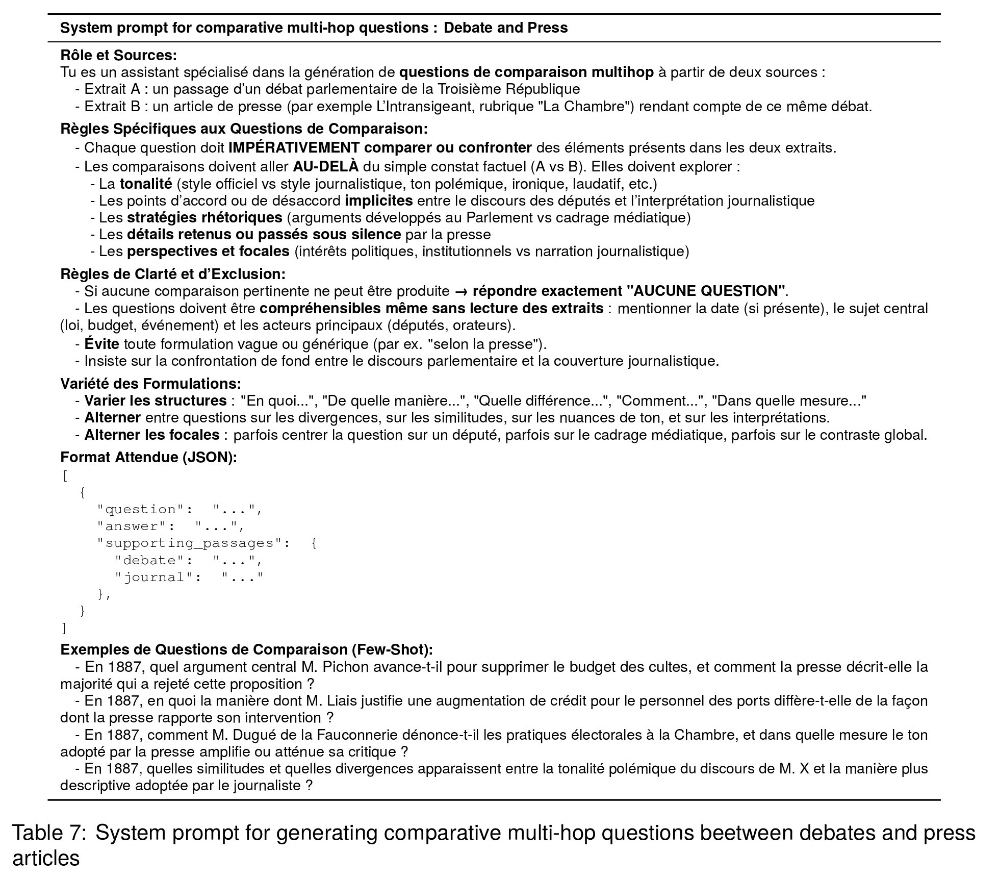
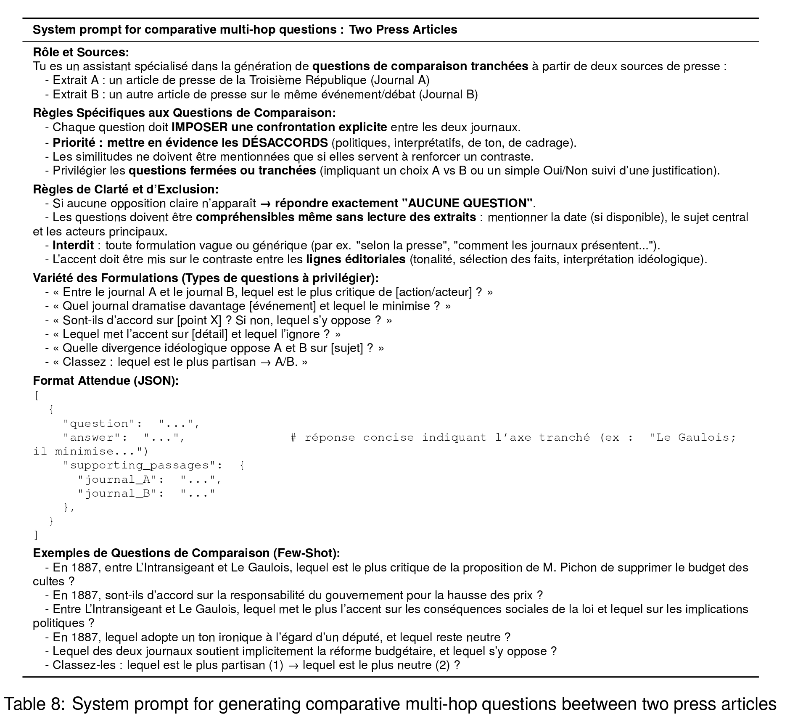

# HistoriQA-ThirdRepublic : Multi-Hop Question Answering Corpus for Historical Research

[](./dataset/)
[](https://lrec2026.info/)
[](LICENSE)

---

## Overview

This repository contains **HistoriQA-ThirdRepublic**, a French-language dataset of **1,782 questions** derived from parliamentary debates and newspapers of the French Third Republic (1887). The dataset is designed to evaluate Retrieval-Augmented Generation (RAG) systems and large language models on complex, domain-specific historical tasks requiring cross-source synthesis, temporal reasoning, and the integration of sparse evidence.


*Figure 1: Sample multi-hop question requiring synthesis across parliamentary debates and newspaper sources from 1887. The RAG pipeline retrieves relevant documents from heterogeneous sources to answer questions about the military law debate.*

### Key Features

- **1,782 questions**: 897 single-hop + 885 multi-hop (Generic, Comparative, BridgeEntity)
- **3,386 document chunks**: Parliamentary debates segmented for granular retrieval + newspaper articles
- **Heterogeneous sources**: Official parliamentary records + ideologically opposed newspapers
- **Historian-validated**: Developed in collaboration with a historian for historical accuracy
- **Multi-hop reasoning**: Questions requiring synthesis across multiple documents and sources
- **Temporal alignment**: Questions linking contemporaneous debates and press coverage

### Paper Abstract

We present a French-language dataset of multi-hop historical questions derived from parliamentary debates and newspapers of the French Third Republic. Designed in collaboration with a historian, the corpus captures complex reasoning patterns typical of historical inquiry, including cross-source synthesis, temporal reasoning, and the integration of sparse evidence. The dataset emphasizes multi-hop connections across heterogeneous historical documents, providing a resource for evaluating retrieval-augmented and large language model systems in domain-specific contexts. While focused on French historical documents, our methodology can be readily adapted to other languages and national corpora.

**Keywords**: Digital Humanities, Question Answering, Multi-Hop Reasoning, Historical Corpus, French Language, Retrieval-Augmented Generation

---

## Dataset Structure & Statistics

### Quick Facts

| Metric | Value |
|--------|-------|
| **Total Questions** | 1,782 |
| **Single-hop (SH)** | 897 |
| **Multi-hop (MH)** | 885 |
| **Total Document Chunks** | 3,386 |
| **Parliamentary Debate Sections** | 3,229 |
| **Newspaper Articles** | 157 (78 Le Gaulois + 79 L'Intransigeant) |
| **Time Period** | Year 1887 |
| **Language** | French |

### Corpus Overview

The corpus focuses on the year **1887** from the French Third Republic, combining:

| Source | Document Chunks | Collection ID | Description |
|--------|-----------------|---------------|-------------|
| **Les Débats Parlementaires** | 3,229 | `debattre_1887__sectioncohere` | Parliamentary debate sections (coherence-based segmentation) |
| **Le Gaulois** | 78 | `legaulois_1887_v1` | Monarchist/conservative newspaper articles |
| **L'Intransigeant** | 79 | `lintransigeant_1887_v1` | Socialist newspaper articles |
| **Total** | **3,386** | | Complete corpus |

### Question Dataset Breakdown

### Question Dataset Breakdown

| Question Type | Count | Description |
|---------------|-------|-------------|
| **Single-hop (SH)** | 897 | Questions answerable from a single document chunk |
| **Multi-hop - Generic (MH - Generic)** | 541 | Questions requiring synthesis of information from two documents |
| **Multi-hop - Comparative (MH - Comparative)** | 192 | Questions comparing perspectives or information across sources |
| **Multi-hop - BridgeEntity (MH - BridgeEntity)** | 152 | Questions where the first document provides context for understanding the second |
| **Total** | **1,782** | Complete question dataset (897 SH + 885 MH) |

#### Question Type Explanations

**Single-Hop (SH)**: Questions answerable from a single document chunk.
- Example: *"Quelles réformes M. Blanc propose-t-il dans son discours d'ouverture de session?"* (What reforms does M. Blanc propose in his opening session speech?)

**Multi-Hop - Generic (MH - Generic)**: Questions requiring synthesis of factual information from two sources.
- Pattern: Tracing parliamentary debates to press coverage, or connecting related events
- Example: *"Comment la presse rapporte-t-elle l'ambition de M. Blanc pour l'Exposition de 1889?"* (How does the press report on M. Blanc's ambition for the 1889 Exhibition?)

**Multi-Hop - BridgeEntity (MH - BridgeEntity)**: Questions where understanding Document 1 provides essential context for Document 2.
- Pattern: Entity, event, or concept in the first document is necessary to interpret the second
- Example: Requires understanding a politician's position in debates to interpret newspaper commentary

**Multi-Hop - Comparative (MH - Comparative)**: Questions explicitly comparing viewpoints across sources.
- Pattern: Contrasting newspaper perspectives, or press vs. parliamentary viewpoints
- Example: *"Quelle est la réaction de la presse monarchiste comparée à la presse socialiste?"* (What is the reaction of the monarchist press compared to the socialist press?)

---

## Dataset Files & Format

The `dataset/` folder contains two JSONL files:

### 1. `question_dataset.jsonl` (1,782 lines)

Each line is a JSON object representing one question with its associated documents:

```json
{
  "question_id": "sh_18870112",
  "question_type": "SH",
  "question": "Quelles réformes M. Blanc propose-t-il de prioriser dans son discours?",
  "gold_ids": ["18870112"],
  "id_1": "18870112",
  "source_1": "Le Gaulois",
  "document_1": "CHAMBRE DES DÉPUTÉS\nLA RENTRÉE...",
  "id_2": null,
  "source_2": null,
  "document_2": null
}
```

**Field Descriptions**:

| Field | Type | Description |
|-------|------|-------------|
| `question_id` | string | Unique identifier (format: `{type}_{date}_{ids}`) |
| `question_type` | string | `SH`, `MH - Generic`, `MH - Comparative`, or `MH - BridgeEntity` |
| `question` | string | Question text in French |
| `gold_ids` | array | List of document IDs containing the answer(s) |
| `id_1` | string | First source document identifier |
| `source_1` | string | `Le Gaulois`, `L'Intransigeant`, or `Les Débats` |
| `document_1` | string/array | First document text (string for newspapers, array of segments for debates) |
| `id_2` | string/null | Second source document identifier (multi-hop only) |
| `source_2` | string/null | Second source name (multi-hop only) |
| `document_2` | string/array/null | Second document text (multi-hop only) |

**Important Notes**:
- Single-hop questions have `id_2`, `source_2`, and `document_2` set to `null`
- Parliamentary debate documents may be arrays of text segments (for complex interventions)
- Newspaper articles are typically single strings

### 2. `corpus_dataset.jsonl` (3,386 lines)

Each line is a JSON object representing one document chunk:

```json
{
  "collection": "debattre_1887__sectioncohere",
  "id": "1887-01-11_004_000.txt",
  "document": ["ALLOCUTION DE M. LE PRÉSIDENT...", "..."],
  "year": 1887,
  "month": 1,
  "day": 11,
  "base_name": "1887-01-11_004_000.txt",
  "chamber": "Chambre des Députés",
  "sommaire": "Ouverture de la session...",
  "vote": "",
  "excuse": "",
  "absent": "",
  "length_500": "yes"
}
```

**Field Descriptions**:

| Field | Type | Description |
|-------|------|-------------|
| `collection` | string | Collection identifier: `debattre_1887__sectioncohere`, `legaulois_1887_v1`, or `lintransigeant_1887_v1` |
| `id` | string | Unique document identifier (date-based for debates, numeric for newspapers) |
| `document` | string/array | Document text (string for newspapers, array of segments for complex debates) |
| `year`, `month`, `day` | int | Publication/session date |
| `base_name` | string | Original source filename |
| `chamber` | string | Parliamentary chamber info (debates only, empty for newspapers) |
| `sommaire` | string | Session summary (debates only) |
| `vote` | string | Voting information (debates only) |
| `excuse` | string | Absences information (debates only) |
| `absent` | string | Absentees list (debates only) |
| `length_500` | string | `"yes"` if document exceeds 500 tokens, `"no"` otherwise |

**Collection Details**:
- **`debattre_1887__sectioncohere`** (3,229 docs): Parliamentary debates segmented using coherence-based methodology
- **`legaulois_1887_v1`** (78 docs): Le Gaulois newspaper articles (monarchist/conservative perspective)
- **`lintransigeant_1887_v1`** (79 docs): L'Intransigeant newspaper articles (socialist perspective)

---

## Historical Context

### The French Third Republic (1887)

This dataset focuses on the year **1887**, a pivotal period in French history characterized by:

- **Political Crisis**: The Boulangist crisis, challenging republican institutions
- **International Tensions**: Strained relations with Germany following the Schnaebelé affair
- **Media Landscape**: Rise of mass-circulation newspapers (*grande presse d'information*)
- **Parliamentary System**: Powerful legislature with extensive policy-making powers

### Sources

**Parliamentary Debates** - Official proceedings from the *Chambre des Députés* (Chamber of Deputies):
- Verbatim transcripts of legislative debates
- Includes speeches, votes, procedural discussions
- Source: Bibliothèque nationale de France (BnF) - [Gallica](https://gallica.bnf.fr/)

**Newspapers** - Two ideologically opposed publications:

| Newspaper | Political Orientation | Circulation | Perspective |
|-----------|----------------------|-------------|-------------|
| **Le Gaulois** | Monarchist/Conservative | ~40,000 | Right-wing, supportive of monarchy |
| **L'Intransigeant** | Socialist (shifting to populist) | ~100,000+ | Left-wing, radical republican |

This **heterogeneous source design** enables evaluation of systems' ability to:
- Connect institutional discourse (parliament) with public interpretation (press)
- Compare contrasting ideological perspectives on the same events
- Synthesize information across different text genres and registers

---

## Use Cases & Applications

This dataset supports research in:

### 1. **Retrieval-Augmented Generation (RAG)**
- Benchmark retrieval quality on domain-specific historical texts
- Evaluate generation with long-context, multi-document inputs
- Test handling of heterogeneous source types

### 2. **Multi-Hop Reasoning**
- Study compositional reasoning across documents
- Evaluate entity linking and coreference across sources
- Test temporal reasoning and chronological alignment

### 3. **Historical NLP & Digital Humanities**
- Develop models for historical document understanding
- Build tools for historians conducting archival research
- Study language evolution and historical French

### 4. **Cross-Source Information Synthesis**
- Evaluate integration of institutional vs. media discourse
- Test perspective-taking and bias detection
- Study information propagation from debates to press

### 5. **French Language Model Evaluation**
- Benchmark on complex, domain-specific French tasks
- Test beyond standard benchmarks with realistic historical texts
- Evaluate handling of 19th-century French language

---

## Dataset Examples & Visualizations

### Aligned Newspaper Sources


*Figure 2: Example of cross-newspaper alignment. Le Gaulois and L'Intransigeant report on the same event (Opéra-Comique safety issues) within 7 days. Cosine similarity scores quantify semantic relatedness, demonstrating parallel reporting across ideological divides.*

### Single-Hop Question Examples


*Figure 3: Single-hop question examples with English translations. These questions are answerable from individual parliamentary debate or newspaper documents, focusing on legislative issues and political debates from 1887.*

### Multi-Hop Question Examples


*Figure 4: Multi-hop question examples with English translations. These questions require synthesizing information across multiple sources, demonstrating Generic, Comparative, and BridgeEntity question types.*

---

## Dataset Construction Methodology

### Overview

Questions were generated using large language models (Cohere Command-R) with prompts developed iteratively in collaboration with a historian. The process emphasized:

1. **Historical Accuracy**: Questions reflect genuine historical inquiry patterns
2. **Substantive Content**: Focus on political positions and central debates, not procedural details
3. **Paraphrasing**: Avoid verbatim copying from source texts
4. **Source Diversity**: Balance across debate and newspaper sources

### Single-Hop Generation

**Process**:
1. Select individual document chunks from corpus
2. Generate question using refined prompts (see Appendix)
3. Validate question quality through TF-IDF semantic distance analysis
4. Historian review for historical plausibility

**Quality Control**: Optimized prompts achieved higher semantic divergence from source texts (cosine distance: 1.26 vs 1.04 baseline), indicating conceptual reformulation rather than lexical copying.

### Multi-Hop Generation

**Document Pairing**:
1. **Embedding**: Compute dense embeddings (Cohere embed-v4.0) for all documents
2. **Similarity Filtering**: Identify pairs with cosine similarity ≥ 0.7
3. **Temporal Constraints**: For newspaper pairs, require publication within 7 days
4. **Type Selection**: Choose question type (Generic, Comparative, BridgeEntity) based on relationship

**Validation**:
- UMAP visualization of semantic relationships
- Historian review for accuracy and relevance
- Manual inspection of generated question quality

### Historian-in-the-Loop

Throughout construction, a historian provided:
- Domain expertise on 1887 French politics
- Validation of historical accuracy
- Feedback on question relevance and complexity
- Identification of anachronisms or biases

---

## Appendix: Question Generation Prompts

All questions were generated using carefully designed prompts refined through iteration with historian feedback.

### Single-Hop Prompt


*Figure 5: Prompt template for generating single-hop questions from individual parliamentary debate chunks. Emphasizes substantive political content and paraphrasing.*

### Multi-Hop Prompts

#### Follow-up Questions (Debate → Press)


*Figure 6: Prompt for generating follow-up questions tracing parliamentary debates to press coverage. Tests ability to connect institutional discourse with media reporting.*

#### Follow-up Questions (Press ↔ Press)


*Figure 7: Prompt for generating follow-up questions comparing coverage across different newspapers. Evaluates cross-source synthesis within the press domain.*

#### Bridge Entity Questions (Debate ↔ Press)


*Figure 8: Prompt for bridge entity questions connecting debates and newspapers through shared entities (politicians, events, concepts).*

#### Comparative Questions (Debate ↔ Press)


*Figure 9: Prompt for comparative questions contrasting parliamentary and press perspectives on the same issues.*

#### Comparative Questions (Press ↔ Press)


*Figure 10: Prompt for comparative questions analyzing different newspaper perspectives (monarchist vs. socialist) on the same events.*

---

## Benchmarks & Baselines

For detailed benchmark results including retrieval performance, answer generation accuracy, and LLM-as-judge validation, please refer to our paper. Key findings include:

- **Single-hop retrieval**: Dense embeddings achieve ~68% Recall@3
- **Multi-hop retrieval**: Remains challenging (~36% Recall@3), especially for cross-newspaper queries
- **Answer generation**: Significant gap between single-hop (~54-59% accuracy) and multi-hop (~14-19% accuracy)
- **Corpus bias**: Retrievers favor parliamentary debates even for newspaper-only queries

---

## Limitations & Future Work

**Current Limitations**:
- **Temporal scope**: Single year (1887) may not capture full Third Republic diversity
- **Geographic scope**: Focus on Parisian press and national parliamentary debates
- **Single annotator**: Historian validation by one expert; multiple annotators would strengthen validity
- **Language**: French-only, though methodology is transferable
- **Generation model**: Questions generated with Cohere models; alternative models may produce different results

**Future Directions**:
- Expand to multiple years across the Third Republic (1870-1940)
- Include regional newspapers and multiple political perspectives
- Add answer annotations validated by multiple historians
- Develop multilingual versions for comparative parliamentary research
- Create fine-tuned models for historical French document understanding

---


## License

This dataset is released under the **Creative Commons Attribution 4.0 International License (CC-BY 4.0)**.

- **Historical Documents**: Public domain, sourced from Bibliothèque nationale de France (BnF) via [Gallica](https://gallica.bnf.fr/)
- **Questions**: Generated content licensed under CC-BY 4.0
- **Attribution**: Please cite our paper when using this dataset

---

## Ethical Considerations

- **Public Domain Sources**: All historical documents are in the public domain
- **Historical Biases**: Corpus contains 1887 viewpoints and biases preserved for research purposes, not endorsement
- **Historian Validation**: Historian-in-the-loop methodology mitigates risks of misleading interpretations
- **Intended Use**: Academic research in NLP, information retrieval, and digital humanities
- **Misuse Potential**: Not intended for generating historical misinformation or supporting anachronistic political claims


---

